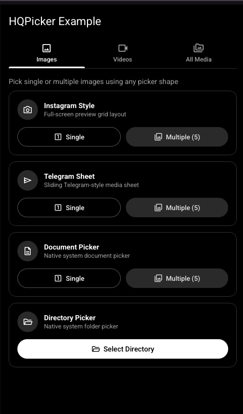
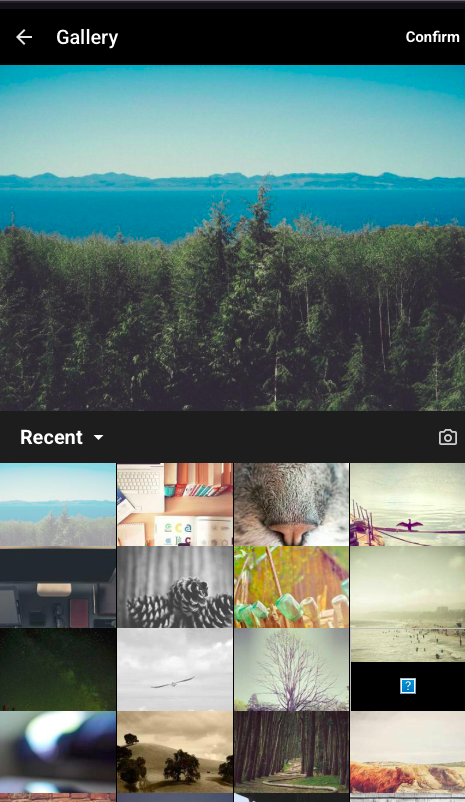
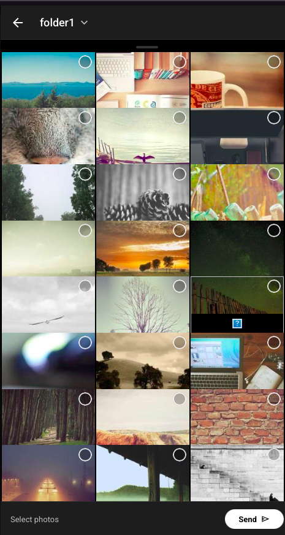

# HQPicker

A high-performance, fully customizable, multi-mode media picker for Flutter — powered by the BLoC pattern. HQPicker delivers 60fps scrolling, zero `setState` sluggishness, and elegant memory management even with thousands of media files.

---

## Preview & Demo

<p align="center">
  
  
  
</p>

### Video Demo

<p align="center">
  <video src="assets/demo.mov" controls width="100%" poster="assets/screenshot_example.png"></video>
</p>

---

## Features

- **Universal Native iOS Aesthetic**: Standardized Apple Human Interface Guidelines (HIG) aesthetic, `CupertinoIcons`, `CupertinoAlertDialog`, `BouncingScrollPhysics`, and frosted glass blur (`BackdropFilter`) across both iOS and Android.
- **0ms Instant Touch Selection**: Isolated per-tile rebuilds via `BlocSelector` for 0ms immediate touch selection response.
- **CustomScrollView & SliverGrid Viewport**: Powered by `CustomScrollView` + `SliverGrid` with `SliverChildBuilderDelegate` for 120fps stutter-free thumbnail scrolling.
- BLoC Architecture — Zero `setState` inside the picker core. Optimized for fast rebuilds and scalability.
- Isolate-Powered Performance — Heavy file resolving, compression, and file system scanning execute in background isolates using `IsolateServices` to eliminate UI thread freezes when selecting large videos (1GB+) or photos.
- Telegram Drag-to-Close Sheet — Draggable bottom sheet with snap points (`0.55`, `1.0`) and smooth swipe-down-to-close behavior.
- Interactive Zoom & BoxFit Preview — Pinch-to-zoom (1.0x to 4.0x) plus interactive aspect ratio fit toggle on the top preview panel.
- Deep Customization System — Complete control over grid columns (`gridCrossAxisCount`), cell spacing, border radius (`gridItemBorderRadius`), badge styles (`number`, `checkMark`, `borderOnly`), positions, and image fitting (`previewFit`, `gridItemFit`).
- Video & File Constraints — Enforce minimum/maximum video duration (`minVideoDuration`, `maxVideoDuration`) and file size limits (`minFileSize`, `maxFileSize`).
- Full-Screen Preview & Details Modal — Built-in full-screen preview and asset information dialog on custom gestures (`doubleTapAction`, `longPressAction`).
- Custom File & Document Views — Toggle between List and Grid modes (`fileViewMode`) with custom extension icon mappings (`customFileTypeIcons`).
- Custom Bottom Send Bar & FAB Animation — Override the send action bar via `bottomSendBarBuilder` or customize floating action button animations.
- Custom Permission Dialog & Loading Widget — Pass `permissionDialogBuilder` to supply app-specific permission dialogs, and `loadingWidget` for custom progress indicators.
- Album Filters & Header Builders — Filter unwanted albums (`albumFilter`) and pass custom header widgets (`headerBuilder`).
- Tactile Haptic Feedback — Native feedback (`HapticFeedback.selectionClick()`, `lightImpact()`, `vibrate()`) for media selection, album toggles, and max-count limits.
- System Back Gesture Support — Integrated `PopScope` to catch Android and iOS system back gestures and close picker sheets gracefully.
- **Automated Temp File Cache Management**: Integrated automatic cache purging (`PhotoManager.clearFileCache()`) and static `HQPicker.clearCache()` helper method to eliminate temporary file accumulation and prevent app storage bloat when selecting large videos (500MB+).
- Auto Memory Cleanup — Automatically clears temporary thumbnail caches (`PhotoManager.clearFileCache()`) on picker disposal.
- Custom Empty Widget — Pass `emptyWidget` to `HQPickerConfig` for custom empty state illustrations when an album has no assets.
- Two Beautiful Picker Styles — Instagram full-screen preview + Telegram draggable bottom sheet.
- Unified `HQPicker` API — One entry-point for all shapes: `instagram`, `telegram`, `document`, `directory`.
- Localization — All visible strings (including `permissionRequired`, `permissionDenied`, `openSettings`, etc.) are configurable via `HQPickerLocalizations` (includes `HQPickerLocalizations.ar()` Arabic preset).
- Custom SnackBar / Toast — Provide `onSnackBar` to replace the built-in SnackBar with any toast/overlay you prefer.
- File System Support — Native document and directory pickers via `file_selector`.

---

## Getting Started

```bash
flutter pub add hq_picker
```

Or add it manually to your `pubspec.yaml`:

```yaml
dependencies:
  hq_picker: ^1.1.0
```

Import in your Dart code:

```dart
import 'package:hq_picker/hq_picker.dart';
```

---

## Platform Setup

### iOS Setup

Add the following keys to your `ios/Runner/Info.plist`:

```xml
<!-- Photo Library Access -->
<key>NSPhotoLibraryUsageDescription</key>
<string>This app requires access to the photo library to pick photos and videos.</string>

<!-- Photo Library Save Permission -->
<key>NSPhotoLibraryAddUsageDescription</key>
<string>This app requires access to save photos to your photo library.</string>

<!-- Camera Access -->
<key>NSCameraUsageDescription</key>
<string>This app requires access to the camera to take photos and videos.</string>

<!-- Microphone Access -->
<key>NSMicrophoneUsageDescription</key>
<string>This app requires access to the microphone for recording videos.</string>
```

> **Note**: Ensure your `ios/Podfile` target platform is set to iOS 13.0 or higher:
> ```ruby
> platform :ios, '13.0'
> ```

### Android Setup

Add the following permissions to `android/app/src/main/AndroidManifest.xml`:

```xml
<uses-permission android:name="android.permission.READ_EXTERNAL_STORAGE" android:maxSdkVersion="32"/>
<uses-permission android:name="android.permission.READ_MEDIA_IMAGES"/>
<uses-permission android:name="android.permission.READ_MEDIA_VIDEO"/>
<uses-permission android:name="android.permission.READ_MEDIA_AUDIO"/>
<uses-permission android:name="android.permission.CAMERA"/>
```

---

## Usage

### 1. Unified `HQPicker.pick(...)` — recommended

```dart
// Instagram style (full-screen)
final results = await HQPicker.pick(
  context: context,
  shape: HQPickerShape.instagram,
  maxCount: 5,
  requestType: HQPickerRequestType.image,
);

// Telegram style (sliding sheet)
final results = await HQPicker.pick(
  context: context,
  shape: HQPickerShape.telegram,
  maxCount: 5,
);

// Native document picker
final docs = await HQPicker.pick(
  context: context,
  shape: HQPickerShape.document,
  allowedExtensions: ['pdf', 'docx'],
);

// Native directory picker
final dir = await HQPicker.pickDirectory();
```

### 2. Convenience shortcuts

```dart
// Images only — Instagram style
final images = await HQPicker.pickImage(
  context: context,
  shape: HQPickerShape.instagram,
  maxCount: 5,
);

// Videos only — Telegram style
final videos = await HQPicker.pickVideo(
  context: context,
  shape: HQPickerShape.telegram,
  maxCount: 3,
);

// Documents
final docs = await HQPicker.pickDocument(
  allowedExtensions: ['pdf'],
);
```

### 3. Inline Telegram sheet

```dart
final GlobalKey<HQPickerTelegramMediaPickersState> _key = GlobalKey();

// In your widget tree:
HQPickerTelegramMediaPickers(
  key: _key,
  requestType: HQPickerRequestType.all,
  maxCountPickMedia: 5,
  maxCountPickFiles: 5,
  config: const HQPickerConfig(),
  onMediaPicked: (assets, files) {
    debugPrint('Picked ${assets?.length} assets, ${files?.length} files');
  },
);

// Open / close:
ElevatedButton(
  onPressed: () => _key.currentState?.toggleSheet(context),
  child: const Text('Open Telegram Sheet'),
);
```

---

## Heavy & Large File Handling (Isolate-Powered)

HQPicker runs background isolates for file resolution and compression. When receiving `List<HQPickerResult>`, you can safely access the file via `result.file` or asynchronously via `result.getFile()` without locking the main UI thread.

```dart
final results = await HQPicker.pickVideo(
  context: context,
  shape: HQPickerShape.telegram,
  maxCount: 1,
);

for (final result in results) {
  // Safely resolve the file in background isolate if not already loaded
  final File? file = await result.getFile();
  if (file != null) {
    // Process or upload using Streams / Chunks for large files (1GB+)
    final Stream<List<int>> fileStream = file.openRead();
  }
}
```

---

## Theming — Full Text-Style Control

Every visible text in the picker can be styled independently via `HQPickerTheme`:

```dart
config: HQPickerConfig(
  theme: HQPickerTheme(
    // Colors
    backgroundColor: Color(0xFF1E1E2E),
    appbarColor: Color(0xFF1E1E2E),
    confirmButtonColor: Colors.deepPurple,
    badgeBackgroundColor: Colors.deepPurple,

    // Text styles
    albumNameTextStyle: TextStyle(
      fontFamily: 'Cairo',
      fontSize: 20,
      fontWeight: FontWeight.bold,
      color: Colors.white,
    ),
    confirmButtonTextStyle: TextStyle(
      color: Colors.white,
      fontWeight: FontWeight.w600,
    ),
    badgeTextStyle: TextStyle(color: Colors.white),
    videoDurationTextStyle: TextStyle(fontSize: 9, color: Colors.yellow),
    emptyListTextStyle: TextStyle(color: Colors.white54, fontSize: 16),
    dialogTitleTextStyle: TextStyle(color: Colors.white),
    dialogContentTextStyle: TextStyle(color: Colors.white70),
    snackBarTextStyle: TextStyle(color: Colors.white),
  ),
),
```

---

## Localization

All strings default to English. Override any or use the built-in Arabic preset:

```dart
// Arabic preset
config: HQPickerConfig(
  localizations: HQPickerLocalizations.ar(),
),

// Or override individual strings
config: HQPickerConfig(
  localizations: HQPickerLocalizations(
    confirm: 'Done',
    gallery: 'My Gallery',
    permissionRequired: 'Access Required',
    permissionDenied: 'Please allow media access in Settings.',
    openSettings: 'Open Settings',
    emptyList: 'No media found',
  ),
),
```

---

## Custom SnackBar / Toast

Replace the default built-in SnackBar with your own notification:

```dart
config: HQPickerConfig(
  showSnackBar: false, // disable built-in snackbar
  onSnackBar: (context, message) {
    // Use any toast library or widget
    Fluttertoast.showToast(msg: message);
  },
),
```

---

## Custom Builders & Overrides

HQPicker provides custom builder callbacks to override preview dialogs, confirm action buttons, and top app bars:

```dart
config: HQPickerConfig(
  // Custom Media Preview Dialog (long press)
  previewDialogBuilder: (context, asset) {
    return Dialog(
      child: CustomMediaViewer(asset: asset),
    );
  },

  // Custom Confirm / Send Button
  confirmButtonBuilder: (context, selectedAssets, onConfirm) {
    return ElevatedButton.icon(
      onPressed: onConfirm,
      icon: Icon(Icons.send),
      label: Text('Send (${selectedAssets.length})'),
    );
  },

  // Custom Instagram AppBar Builder
  appBarBuilder: (context, currentAlbum, selectedAssets, onConfirm, onBack) {
    return AppBar(
      title: Text(currentAlbum?.name ?? 'Gallery'),
      leading: IconButton(icon: Icon(Icons.arrow_back), onPressed: onBack),
      actions: [
        IconButton(icon: Icon(Icons.check), onPressed: onConfirm),
      ],
    );
  },
),
```

---

## Advanced Config

```dart
config: HQPickerConfig(
  // Image processing
  compressImage: true,
  compressQuality: 80,

  // Custom loading overlay during processing
  loadingWidget: Center(
    child: CircularProgressIndicator(color: Colors.deepPurple),
  ),

  // Custom icons
  icons: HQPickerIcons(
    camera: Icon(Icons.camera_alt_outlined),
    cameraVideo: Icon(Icons.video_call_outlined), // video camera in Instagram toolbar
    dropdown: Icon(Icons.expand_more),
  ),
),
```

---

## Return Type

All pickers return `List<HQPickerResult>`:

```dart
final results = await HQPicker.pick(...);

for (final result in results) {
  final File? file = await result.getFile(); // Asynchronously resolved File
  final AssetEntity? asset = result.asset;   // Original gallery asset
}
```

---

## HQPickerConfig Reference

| Property | Type | Default | Description |
|---|---|---|---|
| `theme` | `HQPickerTheme` | default dark | All colors & text styles |
| `localizations` | `HQPickerLocalizations` | English | All UI strings |
| `icons` | `HQPickerIcons` | Material icons | All picker icons |
| `compressImage` | `bool` | `true` | Compress images before returning |
| `compressQuality` | `int` | `80` | JPEG compression quality (0–100) |
| `gridCrossAxisCount` | `int?` | `null` | Custom number of columns in picker grid |
| `gridCrossAxisSpacing` | `double` | `2.0` | Horizontal spacing between cells |
| `gridMainAxisSpacing` | `double` | `2.0` | Vertical spacing between cells |
| `gridChildAspectRatio` | `double` | `1.0` | Aspect ratio of grid cells |
| `gridItemBorderRadius` | `BorderRadius?` | `null` | Rounded corners for asset cells |
| `selectionStyle` | `HQPickerSelectionStyle` | `number` | Selection style (`number`, `checkMark`, `borderOnly`) |
| `badgePosition` | `HQPickerBadgePosition` | `topRight` | Position of selection badge on cell |
| `enableSelectionAnimation` | `bool` | `true` | Scale animation on tile selection |
| `minVideoDuration` | `Duration?` | `null` | Minimum allowed video duration |
| `maxVideoDuration` | `Duration?` | `null` | Maximum allowed video duration |
| `enableFullScreenPreview` | `bool` | `true` | Long press full-screen asset preview modal |
| `preferredCameraLens` | `HQPickerCameraLens` | `back` | In-app camera direction (`back` / `front`) |
| `cameraCaptureMode` | `HQPickerCameraCaptureMode` | `all` | Camera capture mode (`all`, `photoOnly`, `videoOnly`) |
| `fileViewMode` | `HQPickerFileViewMode` | `list` | Document/file layout mode (`list` or `grid`) |
| `customFileTypeIcons` | `Map<String, Widget>?` | `null` | Custom icons for file extensions |
| `doubleTapAction` | `HQPickerGestureAction` | `none` | Action on double-tap (`select`, `preview`, `showInfo`) |
| `longPressAction` | `HQPickerGestureAction` | `preview` | Action on long-press (`select`, `preview`, `showInfo`) |
| `bottomSendBarBuilder` | `HQBottomSendBarBuilder?` | `null` | Custom bottom send bar builder |
| `sendButtonAnimation` | `bool` | `true` | Send FAB animation toggle |
| `permissionDialogBuilder` | `HQPermissionDialogBuilder?` | `null` | Custom system permission dialog builder |
| `previewDialogBuilder` | `HQAssetPreviewBuilder?` | `null` | Custom asset preview dialog builder (long press) |
| `confirmButtonBuilder` | `HQConfirmButtonBuilder?` | `null` | Custom confirm / send button builder |
| `appBarBuilder` | `HQAppBarBuilder?` | `null` | Custom AppBar builder for Instagram shape |
| `albumFilter` | `HQAlbumFilter?` | `null` | Filter predicate to hide specific albums |
| `headerBuilder` | `HQHeaderBuilder?` | `null` | Custom picker header builder |
| `onMaxCountReached` | `VoidCallback?` | `null` | Callback when max selection limit is reached |
| `onAssetTap` | `Function?` | `null` | Callback on asset cell tap |
| `onAlbumChanged` | `Function?` | `null` | Callback on album selection change |
| `showSnackBar` | `bool` | `true` | Show built-in SnackBar on selection error |
| `onSnackBar` | `Function?` | `null` | Custom SnackBar / toast callback |
| `loadingWidget` | `Widget?` | `CircularProgressIndicator` | Overlay shown during asset processing |
| `emptyWidget` | `Widget?` | `null` | Custom widget displayed when an album is empty |
| `maxFileSize` | `int?` | `null` | Max file size in bytes with warning feedback |
| `sortOrder` | `HQPickerSortOrder` | `newestFirst` | Asset sorting order (`newestFirst` or `oldestFirst`) |
| `assetItemBuilder` | `HQAssetItemBuilder?` | `null` | Custom tile builder for grid asset items |
